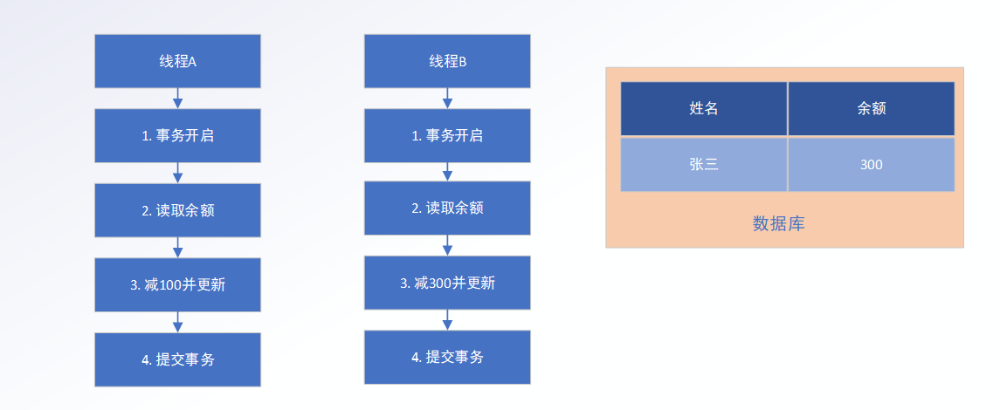

# springboot-study
回顾一下springboot并根据知识点整理代码

## async
测试异步功能

## auto configuration
测试自定义自动配置, 如果存在User类,则新建一个Bean

## 事务 Transaction 
测试事务的传播行为
#### readOnly配置
 readOnly的事务进行修改行为会报错如下:
 
    Connection is read-only. Queries leading to data modification are not allowed

#### 隔离 Isolation

 
假如我们当前有线程A、线程B，分别执行一个事务，假如当前的顺序是，
##### 读未提交(READ_UNCOMMITTED)
也称为脏读，就是一个事务可以读取另一个事务未提交的内容

   A 事务开启，那么当前A读取的余额是300,然后减去100，更新表记录为200，当前A的事务还未提交，但是B读到了200，那么他检查余额后，直接失败了，如果A事务正常执行下去没什么问题，但是A事务回滚了，那么其实数据库还是300，那么B事务本来是可以成功的，但是没有成功。这是余额不够的情况下，如果脏读的是A事务增加了100，那么脏读到的就是400，那么就可以买400的东西，如果数据库也是此级别的，那么下单就成功了，平台就白白损失了100块。
防止这种结果，是不是可以不让读事务未提交的内容？

##### 读已提交(READ_COMMITTED)
也称为不可重复读，就是一个事务只可以读取另一个事务提交的内容

   A事务开启，当前A事务读取余额是300，然后减去100，此时B进来了，因为事务还没有提交，所以此时B读取的还是300，然后执行成功，提交事务，但是在A事务进行提交时，检测到当前余额已经没有钱，就像是刚才读的是假的，在同一个事务中出现了两次不同的读取结果，所以称为不可重复读。
  那么防止这种结果，就不能再一个事务已经读了之后，不能再进行update操作？也可以只锁对应的竞争资源，不允许更新

##### 可重复读(REPEATABLE_READ)
一个事务在读取了记录之后，这条记录不能再被修改

  不能被修改记录后，那么无论怎样，对于单条记录相当于上了一个不可重入锁，所以不会再有重复读的问题。假如我有新的需求了，我要统计两下当前平台的所有会员的余额，在第一次统计结束，我在控制台打印出来是300，但是Insert语句还在，现在李四新注册一个，然后冲了200，第二次打印发现打印出来是500，两次不一致，就像是刚才发生了幻觉一样，所以又称会幻读。
如果我不想幻读，怎么办，只能让所有的事务顺序执行，这样就不会再事务中和事务结束会有两个不同的结果了。所以对于这种只能锁表

##### 串行化(SERIALIZABLE)
一个事务必须等待另一个事务执行完成再可以执行。

   A事务开启，并读取余额，那么当前A读取的余额是300,然后减去100，更新表记录为200提交事务，那么B再进行一遍流程，会发现余额不足够减去。这就是事务的串行化，一个一个执行，那么无论发生什么都不会出现问题。

